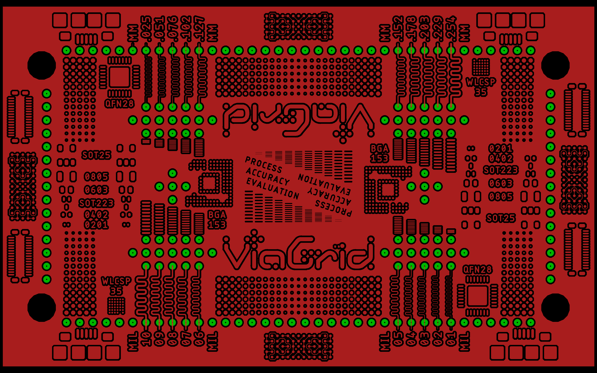
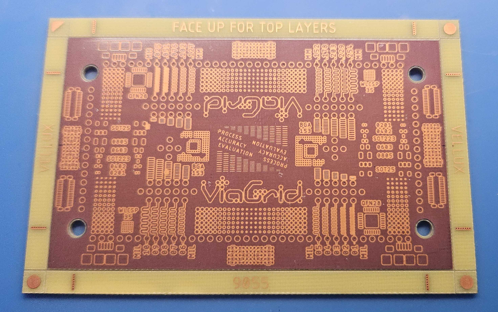

# Process Tests
  
These tests can be used to detemine the accuracy and minimum feature size of your machine of choice for use with Viagrid (or PCB fabrication in general!)

Currently, only the 9055 Standard ViaGrid blank has a feature test available. You can find the EAGLE board file and gerber zip in this directory.

In the example below, a minimum trace width of 3 mil was demonstrated (better images coming soon).  

#### *This section is a work in progress. Please let us know if you want to help!*
